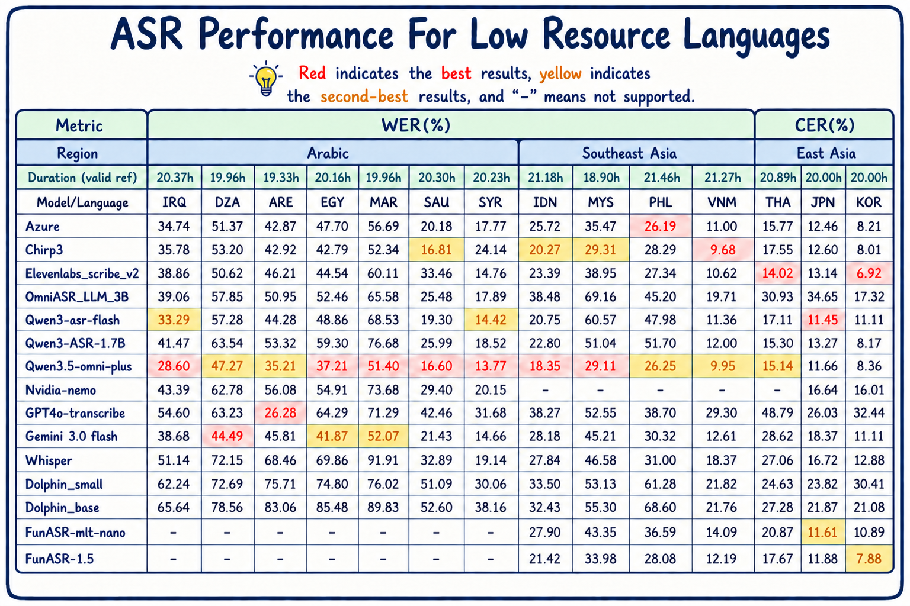

<h1 align="center">🌍 GigaSpeechBench</h1>

<p align="center">
  <b>A large-scale multilingual ASR & AST benchmark (600+ hours) spanning low-resource languages, dialects, accents, and domains. The low-resource language subset includes Chinese–English–Japanese translations for speech translation (AST) evaluation.</b>
</p>

<p align="center">
  <a href="README_zh.md">🇨🇳 中文版</a>
</p>

<p align="center">
  
  
  
  
</p>

<p align="center">
  <a href="#-call-for-contributions">📣 Call for Contributions</a> •
  <a href="#-leaderboard">🏆 Leaderboard</a> •
  <a href="#-dataset">📦 Dataset</a> •
  <a href="#-quick-start">🚀 Quick Start</a> •
  <a href="#-evaluation">📊 Evaluation</a>
</p>

---

## 📣 Call for Contributions

**We need your help!** GigaSpeechBench covers 14+ low-resource languages and dialects, but our team lacks native speakers for many of them. The `text_norm/` module — which handles language-specific text normalization before WER/CER scoring — has significant room for improvement.

**If you are a native speaker** of any of our supported languages (Arabic dialects, Indonesian, Malay, Filipino/Tagalog, Vietnamese, Thai, Japanese, Korean), we warmly invite you to:

- 🔍 Review the normalization rules in `text_norm/{LANG}.py`
- 🐛 Report issues with incorrect normalization
- � Open an [Issue](https://github.com/AlexTYJ/GigaSpeechBench/issues) to suggest improvements for your language

We also welcome:
- 📊 New model evaluation results (use `scripts/save_results.py`)
- 🌐 Support for additional languages

---

## 📅 Timeline

> 🚀 **2026-05-04** — GitHub repository released  
> 📦 **Coming soon** — Full dataset release on HuggingFace

---

## 🏆 Leaderboard

> **Low-Resource Languages ASR — WER/CER (%) ↓**

<p align="center">
  
</p>

### 🗺 Language Key

| Code | Language | Region |
|:-----|:---------|:-------|
| IRQ | Iraqi Arabic | Arab Region |
| DZA | Algerian Arabic | Arab Region |
| ARE | Emirati Arabic | Arab Region |
| EGY | Egyptian Arabic | Arab Region |
| MAR | Moroccan Arabic | Arab Region |
| SAU | Saudi Arabic | Arab Region |
| SYR | Syrian Arabic | Arab Region |
| IDN | Indonesian | Southeast Asia |
| MYS | Malay | Southeast Asia |
| PHL | Filipino (Tagalog) | Southeast Asia |
| VNM | Vietnamese | Southeast Asia |
| THA | Thai | Southeast Asia |
| JPN | Japanese | East Asia |
| KOR | Korean | East Asia |

---

## 📦 Dataset

### 📈 Low-Resource Languages Overview

| Stat | Value |
|:-----|:------|
| Languages | 14 |
| Total Duration | ~280+ hours |
| Total Segments | 260,000+ |
| Audio Format | WAV (16kHz mono) |
| Annotation | Human-annotated transcription with speaker metadata |
| Source | YouTube, curated per-language |

### 📝 Data Format (GigaSpeech-style)

Each language has a `metadata.json` following the GigaSpeech format:

```json
{
  "audios": [
    {
      "aid": "ARE#UCIJXOvggjKtCagMfxvcCzAA#RVSrDuhYDZA#raw",
      "duration": 228.195,
      "segments": [
        {
          "sid": "ARE#UCIJXOvggjKtCagMfxvcCzAA#RVSrDuhYDZA#raw_1",
          "begin_time": 165.613,
          "end_time": 169.92,
          "text": "ياسيدي هذي مشكلة يعني طويلة، الواقع هو شوف احنا.",
          "speaker": "Speaker1",
          "gender": "Male"
        }
      ]
    }
  ]
}
```

Model results also follow the same GigaSpeech-style format:

```json
{
  "audios": [
    {
      "aid": "ARE#UCIJXOvggjKtCagMfxvcCzAA#RVSrDuhYDZA#raw",
      "segments": [
        {
          "sid": "ARE#...#raw_1",
          "begin_time": 165.613,
          "end_time": 169.92,
          "text": "model transcription here",
          "lang": "ARE"
        }
      ]
    }
  ]
}
```

### 📂 Directory Layout

```
dataset/
├── data/{LANG}/
│   ├── metadata.json       # GigaSpeech-style ref annotations
│   ├── audio/*.wav          # Audio files
│   └── md5                  # Audio checksums
└── results/
    ├── azure.json           # Model hypotheses (GigaSpeech-style)
    ├── chirp3.json
    └── ...
```

---

## 🚀 Quick Start

### ⚙️ Requirements

```bash
pip install -r requirements.txt
```

### 🔄 Run Evaluation

```bash
bash example.sh /path/to/dataset
```

This runs the full 4-step pipeline:
1. **Convert** — Parse GigaSpeech-style JSON into flat format
2. **Normalize** — Language-specific text normalization (parallel, cached)
3. **Evaluate** — Compute WER/CER with segment alignment
4. **Report** — Generate Excel with per-model, per-language results

Options:
```bash
bash example.sh /path/to/dataset --force         # Overwrite all outputs
bash example.sh /path/to/dataset --workers 8     # Parallel normalization
```

### ➕ Adding a New Model

Use the helper to generate correctly formatted results:

```python
from scripts.save_results import ResultWriter

writer = ResultWriter()
for segment in my_results:
    writer.add(
        audio_name="ARE#UC...#raw",
        begin_time=0.0,
        end_time=5.0,
        text="transcribed text",
        lang="ARE"
    )
writer.save("results/my_model.json")
```

Then re-run the pipeline.

---

## 📊 Evaluation

- **WER** (Word Error Rate): For alphabetic languages (Arabic, Indonesian, Vietnamese, etc.)
- **CER** (Character Error Rate): For CJK languages (Japanese, Korean, Thai)
- Language-specific text normalization is applied before scoring
- Segment matching uses (audio_name, start, end) with 0.1s tolerance

---

## 📁 Project Structure

```
GigaSpeechBench/
├── example.sh              # One-command evaluation pipeline
├── requirements.txt        # Python dependencies
├── data_process/
│   ├── convert_data.py     # GigaSpeech JSON → flat format
│   └── normalize.py        # Parallel text normalization with caching
├── scripts/
│   ├── compute_wer_single.py  # WER/CER computation
│   ├── excel_single.py     # Per-module Excel report
│   ├── merge_excel.py      # Merge all results into one Excel
│   ├── save_results.py     # Helper for model output formatting
│   └── check.py            # Submission format validator
├── text_norm/              # Per-language text normalizers (contributions welcome!)
└── third_party/            # Model integration scripts
    ├── Azure/
    ├── Chirp3/
    ├── Qwen3ASR/
    ├── whisper-large-v3/
    └── ...
```

---

## 📄 License

This project is for **non-commercial research purposes only**. The audio data is sourced from publicly available content and is subject to the original content creators' licenses.

