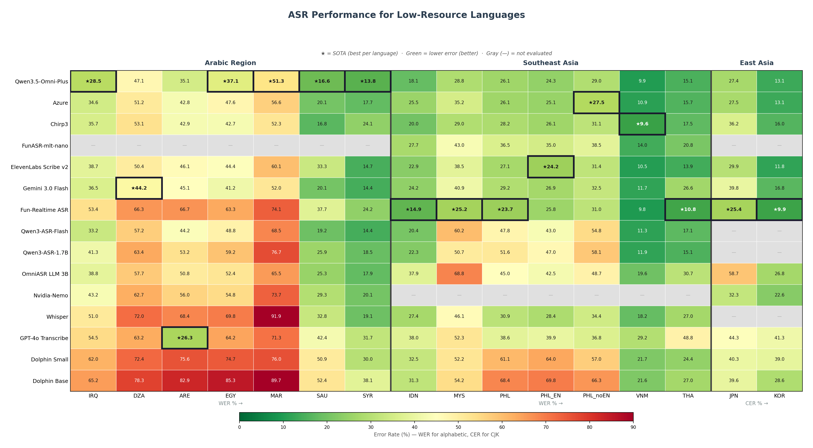

<h1 align="center">🌍 GigaSpeechBench</h1>

<p align="center">
  <b>大规模多语种 ASR & AST 基准（600+ 小时），覆盖低资源语言、方言、口音和领域。低资源语言子集附带中英日三语翻译，可用于语音翻译（AST）评测。</b>
</p>

<p align="center">
  <a href="README.md">English</a>
</p>

<p align="center">
  ⭐ <b>欢迎先 Star 关注！</b>全量数据即将发布至 HuggingFace。
</p>

<p align="center">
  
  
  
  
</p>

<p align="center">
  <a href="#-征集贡献">📣 征集贡献</a> •
  <a href="#-排行榜">🏆 排行榜</a> •
  <a href="#-数据集">📦 数据集</a> •
  <a href="#-快速开始">🚀 快速开始</a> •
  <a href="#-评测">📊 评测</a>
</p>

---

## 📣 征集贡献

**我们需要你的帮助！** GigaSpeechBench 覆盖 14+ 种低资源语言和方言，但我们的团队缺少许多语言的母语能力者。`text_norm/` 模块——负责 WER/CER 评分前的语言特定文本归一化——有很大的改进空间。

**如果你是以下语言的母语使用者**（阿拉伯语方言、印尼语、马来语、菲律宾语/他加禄语、越南语、泰语、日语、韩语），我们热忱邀请你：

- 🔍 审查 `text_norm/{LANG}.py` 中的归一化规则
- 🐛 反馈不正确的归一化问题
- � 在 [Issue](https://github.com/AlexTYJ/GigaSpeechBench/issues) 中提出你母语的改进建议

我们同样欢迎：
- 📊 新模型评测结果（使用 `scripts/save_results.py`）
- 🌐 新语言支持

---

## 📅 时间线

> 🚀 **2026-05-04** — GitHub 仓库发布  
> 📦 **即将发布** — 完整数据集发布至 HuggingFace

---

## 🏆 排行榜

> **低资源语言 ASR — 词/字错误率 (%) ↓**

<p align="center">
  
</p>

### 🗺 语言代码

| 代码 | 语言 | 地区 |
|:-----|:-----|:-----|
| IRQ | 伊拉克阿拉伯语 | 阿拉伯地区 |
| DZA | 阿尔及利亚阿拉伯语 | 阿拉伯地区 |
| ARE | 阿联酋阿拉伯语 | 阿拉伯地区 |
| EGY | 埃及阿拉伯语 | 阿拉伯地区 |
| MAR | 摩洛哥阿拉伯语 | 阿拉伯地区 |
| SAU | 沙特阿拉伯语 | 阿拉伯地区 |
| SYR | 叙利亚阿拉伯语 | 阿拉伯地区 |
| IDN | 印度尼西亚语 | 东南亚 |
| MYS | 马来语 | 东南亚 |
| PHL | 菲律宾语（他加禄语） | 东南亚 |
| VNM | 越南语 | 东南亚 |
| THA | 泰语 | 东南亚 |
| JPN | 日语 | 东亚 |
| KOR | 韩语 | 东亚 |

---

## 📦 数据集

### 📈 低资源语言板块概览

| 统计项 | 数值 |
|:-------|:-----|
| 语言数 | 14 |
| 总时长 | ~280+ 小时 |
| 总片段数 | 26 万+ |
| 音频格式 | WAV（16kHz 单声道） |
| 标注方式 | 人工转写，含说话人元信息 |
| 数据来源 | YouTube，按语种精选 |

### 📝 数据格式（GigaSpeech 风格）

每种语言包含一个 `metadata.json`，采用 GigaSpeech 格式：

```json
{
  "audios": [
    {
      "aid": "ARE#UCIJXOvggjKtCagMfxvcCzAA#RVSrDuhYDZA#raw",
      "duration": 228.195,
      "segments": [
        {
          "sid": "ARE#UCIJXOvggjKtCagMfxvcCzAA#RVSrDuhYDZA#raw_1",
          "begin_time": 165.613,
          "end_time": 169.92,
          "text": "ياسيدي هذي مشكلة يعني طويلة، الواقع هو شوف احنا.",
          "speaker": "Speaker1",
          "gender": "Male"
        }
      ]
    }
  ]
}
```

模型结果也采用相同的 GigaSpeech 风格格式：

```json
{
  "audios": [
    {
      "aid": "ARE#UCIJXOvggjKtCagMfxvcCzAA#RVSrDuhYDZA#raw",
      "segments": [
        {
          "sid": "ARE#...#raw_1",
          "begin_time": 165.613,
          "end_time": 169.92,
          "text": "模型转写结果",
          "lang": "ARE"
        }
      ]
    }
  ]
}
```

### 📂 目录结构

```
dataset/
├── data/{LANG}/
│   ├── metadata.json       # GigaSpeech 风格标注
│   ├── audio/*.wav          # 音频文件
│   └── md5                  # 音频校验和
└── results/
    ├── azure.json           # 模型假设（GigaSpeech 风格）
    ├── chirp3.json
    └── ...
```

---

## 🚀 快速开始

### ⚙️ 环境依赖

```bash
pip install -r requirements.txt
```

### 🔄 运行评测

```bash
bash example.sh /path/to/dataset
```

完整 4 步流程：
1. **转换** — 解析 GigaSpeech 风格 JSON 为扁平格式
2. **归一化** — 按语言做文本归一化（多核并行，支持缓存）
3. **评测** — 按段对齐计算 WER/CER
4. **报告** — 生成 Excel 结果表

选项：
```bash
bash example.sh /path/to/dataset --force         # 覆盖所有输出
bash example.sh /path/to/dataset --workers 8     # 并行归一化
```

### ➕ 接入新模型

使用辅助工具生成正确格式的结果：

```python
from scripts.save_results import ResultWriter

writer = ResultWriter()
for segment in my_results:
    writer.add(
        audio_name="ARE#UC...#raw",
        begin_time=0.0,
        end_time=5.0,
        text="转写结果",
        lang="ARE"
    )
writer.save("results/my_model.json")
```

然后重新运行流程即可。

---

## 📊 评测

- **WER**（词错误率）：用于字母文字语言（阿拉伯语、印尼语、越南语等）
- **CER**（字错误率）：用于 CJK 语言（日语、韩语、泰语）
- 评测前会对每种语言进行相应的文本归一化
- 段级匹配基于 (audio_name, start, end)，容差 0.1 秒

---

## 📁 项目结构

```
GigaSpeechBench/
├── example.sh              # 一键评测流程
├── requirements.txt        # Python 依赖
├── data_process/
│   ├── convert_data.py     # GigaSpeech JSON → 扁平格式
│   └── normalize.py        # 多核并行文本归一化（支持缓存）
├── scripts/
│   ├── compute_wer_single.py  # WER/CER 计算
│   ├── excel_single.py     # 单模块 Excel 报告
│   ├── merge_excel.py      # 合并所有结果为总表
│   ├── save_results.py     # 模型输出格式化工具
│   └── check.py            # 提交格式校验
├── text_norm/              # 各语言文本归一化（欢迎贡献！）
└── third_party/            # 模型接入脚本
    ├── Azure/
    ├── Chirp3/
    ├── Qwen3ASR/
    ├── whisper-large-v3/
    └── ...
```

---

## 📄 许可

本项目仅供**非商业研究用途**。音频数据来源于公开内容，受原始内容创作者许可协议约束。

